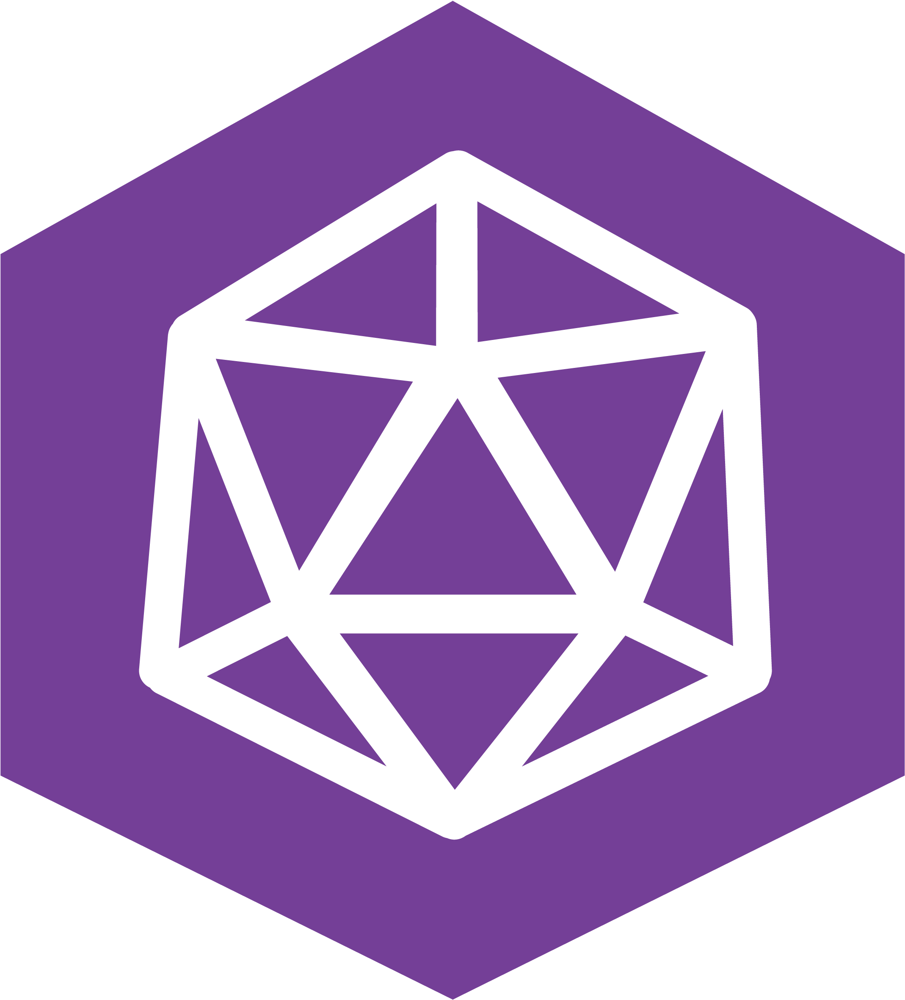

## Faaala Devs, sejam bem vindos 👋

### Me chamo Filipe, comecei minha carreira como desenvolvedor frontend, desenvolvendo em JavaScript. Mas, porém, entretanto, todavia, hoje desbravo os campos do backend como desenvolvedor/analista, implementando e desenvolvendo soluções com o Planning Analytics da IBM, conhecido também como TM1!

#### Aqui no meu perfil, você encontrará majoritariamente alguns projetos que fiz quando estava aprendendo frontend, mas em um futuro próximo, pretendo trazer algumas integrações com o TM1.

 

    
    

    
    

 

    
    
    

 

    
    
    
    
    

